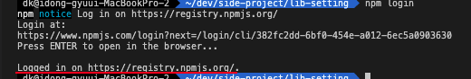

# npm lib setting

## 1. npm login

- npm 사이트에 로그인 부터 하자

```sh
    # in terminal
    npm login
```




## Major version vs Minor version


```sh

    pnpm run release OR pnpm run pre-release

    ## major version
    1.0.0
    2.0.0
    3.0.0

    ## minor version
    1.1.0
    1.2.0
    1.3.0

    ## patchs
    1.0.1
    1.0.2
    1.0.3
```
